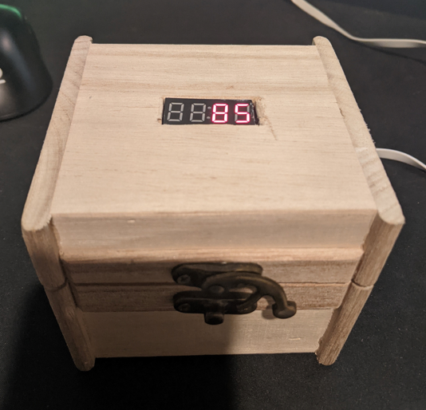

# Day Counter Box for Jules :)
This project counts the days since Jules and I met each other.

## Parts Used
- Digispark ATtiny85 & MicroUSB cable
- DS3231 RTC Module & CR2032 battery (Charging circuit cut)
- TM1637 4 character 7-segment display
- Mini wooden chest from Michaels
- Hot Glue

## Photos

